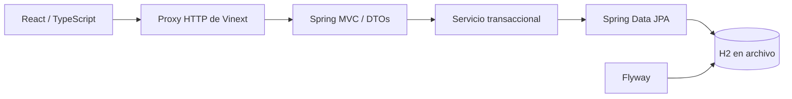

# Arquitectura y decisiones

## Flujo completo



En modo demo, React utiliza un adaptador de `localStorage` y no recorre este flujo. Ambos modos usan el mismo modelo y validaciones de la interfaz.

## Por qué esta estructura

- **Un monolito backend pequeño:** una sola entidad y un dominio acotado no justifican microservicios. La separación controlador/servicio/repositorio permite evolucionar sin introducir infraestructura innecesaria.
- **DTOs de entrada y salida:** los clientes no asignan `id`, fechas o versiones nuevas directamente a la entidad. El servicio controla los cambios.
- **H2 en archivo:** arranque reproducible sin depender de una base instalada. La persistencia sobrevive al reinicio del proceso.
- **Flyway y `ddl-auto: validate`:** el esquema está versionado y Hibernate comprueba que coincida; no altera tablas automáticamente.
- **Proxy de origen único:** el navegador llama a su propio servidor y no necesita CORS abierto. La URL Java se configura en el servidor, no en un campo editable por el visitante.
- **Control optimista:** `@Version` y el parámetro de versión evitan sobrescribir cambios obsoletos en actualización y eliminación.

## Responsabilidades

| Componente | Responsabilidad |
| --- | --- |
| `IssueController` | Rutas, validación de parámetros y códigos HTTP. |
| `IssueService` | Transacciones, reglas de actualización, consultas, estadísticas. |
| `IssueRepository` | Persistencia y especificaciones JPA. |
| `IssueRequest` | Validación y normalización de texto. |
| `IssueResponse` | Contrato estable de salida. |
| `ApiExceptionHandler` | Errores Problem Details y conflictos. |
| `lib/issues.ts` | Tipos y validación del frontend, adaptador de demo y cliente HTTP. |
| `app/page.tsx` | Estado visual, formularios, filtros y diálogos. |
| `app/api/backend/[...path]` | Proxy a rutas permitidas de la API, sin redirecciones y con timeout. |

## Modelo de datos

`issues`: identificador numérico, versión, título, descripción, estado, prioridad, responsable, creación y última actualización.

Los estados y prioridades son enums en Java y tipos restringidos en TypeScript. La base incluye restricciones `CHECK`. Hay índices por estado/prioridad y por fecha/ID. Las consultas usan parámetros JPA; `%` y `_` se tratan como caracteres literales en la búsqueda.

La lista se pagina en el servidor. Las estadísticas son globales. El primer criterio de ordenación es `updatedAt DESC`; el ID desempata, haciendo estable el orden.

## Errores y concurrencia

Una actualización incluye la versión que leyó el cliente. Si difiere, la API responde 409 y no aplica los cambios. También se comprueba la versión al eliminar. La columna JPA protege frente a una modificación concurrente ocurrida después de la comprobación del servicio.

La demo realiza una comprobación básica de versión al leer/escribir. `localStorage` no proporciona transacciones entre pestañas: la demo no sustituye las garantías de concurrencia de la API.

Las peticiones de listado se cancelan al cambiar filtros para evitar que una respuesta antigua reemplace resultados recientes. Los errores de almacenamiento no provocan un borrado automático.

## Límites conocidos

- Spring Security: autenticación por sesión, BCrypt, CSRF y autorización por rol en cada petición. Despliegue Java todavía local.
- Sin auditoría histórica ni relaciones entre usuarios e incidencias.
- La búsqueda usa `LIKE`; para gran volumen se evaluaría búsqueda indexada específica del motor.
- Cuatro consultas calculan las estadísticas; no representan una instantánea atómica si hay cambios simultáneos.
- No se ejecutaron pruebas de carga ni de PostgreSQL.
- Herramienta WebMCP opcional: `start_issue_creation` prepara el formulario; no guarda datos. Su disponibilidad depende del navegador.

## Evolución propuesta

Catálogo de usuarios, historial de cambios, PostgreSQL validado, observabilidad, contenedores y CI. Cada incorporación debe resolver una necesidad concreta, con sus pruebas correspondientes.

## Autenticación y roles

La API usa Spring Security con sesiones de servidor. `admin` tiene rol ADMIN y `usuario` tiene rol USER. Ambos consultan, crean y editan todas las incidencias del espacio compartido; solo ADMIN elimina. No existe aislamiento por propietario. El campo responsable sigue siendo texto libre.

Antes de iniciar Java, define `ISSUEFLOW_ADMIN_PASSWORD` y `ISSUEFLOW_USER_PASSWORD` con valores diferentes de al menos 12 caracteres. No hay contraseñas predeterminadas. Se aplica BCrypt con costo 12; las dos cuentas se cargan en memoria al arrancar. No se incluye registro, recuperación de contraseña ni administración de usuarios.

En PowerShell 7 puedes introducirlas sin mostrarlas en pantalla:

```powershell
$env:ISSUEFLOW_ADMIN_PASSWORD = Read-Host 'Contraseña de admin (mínimo 12 caracteres)' -MaskInput
$env:ISSUEFLOW_USER_PASSWORD = Read-Host 'Contraseña de usuario (mínimo 12 caracteres)' -MaskInput
java -jar target/issueflow-1.0.0.jar
```

Las variables deben establecerse en la terminal donde arranca Java. Spring Boot no carga archivos `.env` automáticamente. Las contraseñas incluidas en las pruebas son exclusivamente datos de prueba.

La cookie `ISSUEFLOW_SESSION` es HttpOnly y SameSite=Strict, la sesión cambia de identificador al autenticarse y caduca tras 30 minutos de inactividad. El cierre de sesión la invalida. En un despliegue HTTPS directo del backend configura `SESSION_COOKIE_SECURE=true`; el proxy aplica Secure cuando la petición entrante es HTTPS. No se guardan contraseñas ni tokens de autenticación en localStorage.

Las escrituras y el login/logout requieren un token CSRF obtenido de `/api/auth/csrf`. El cliente solicita un token antes de cada escritura; el proxy solo transmite la cookie de Issueflow y el encabezado CSRF, valida el origen y no reenvía cookies de la plataforma.

La demo alojada permite elegir un rol sin contraseña y guarda datos ficticios en este navegador. Los roles de esa demo son una simulación de interfaz, no una barrera de seguridad. El acceso real se valida en Java, cuyo despliegue externo sigue pendiente.

Antes de exponer Java a Internet faltan límites de intentos de login, HTTPS, gestión de usuarios y operación de respaldos. Esta entrega no contrata infraestructura.
